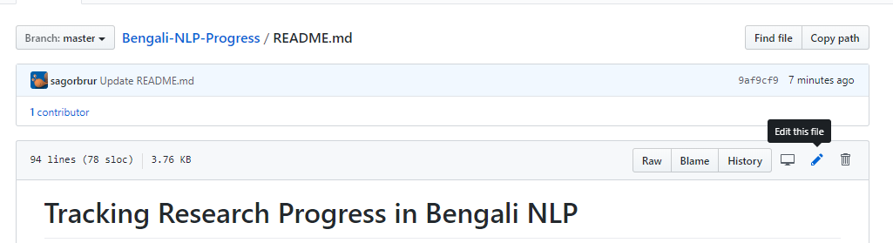
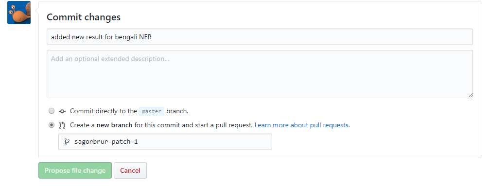

# Tracking Research Progress in Bengali NLP
Repository  to track state of the art research progress in Bengali natural language processing for most common task.

This is the initial approach to create a Bengali nlpprogress tracker for sota like [nlpprogress](https://github.com/sebastianruder/NLP-progress)

## Table of Contents
- [Part-of-speech tagging](tasks/part_of_speech_tagging.md)

## Contributing
#### Guidelines

**Results** &nbsp; Results reported in published papers are preferred; an exception may be made for influential preprints.

**Datasets** &nbsp; Datasets should have been used for evaluation in at least one published paper besides 
the one that introduced the dataset.

**Code** &nbsp; We recommend to add a link to an implementation 
if available. You can add a `Code` column (see below) to the table if it does not exist.
In the `Code` column, indicate an official implementation with Official.
If an unofficial implementation is available, use Link.
If no implementation is available, you can leave the cell empty.

#### Adding a new result

If you would like to add a new result, you can just click on the small edit button in the top-right
corner of the file for the respective task (see below).

This allows you to edit the file in Markdown. Simply add a row to the corresponding table in the
same format. Make sure that the table stays sorted (with the best result on top). 
After you've made your change, make sure that the table still looks ok by clicking on the
"Preview changes" tab at the top of the page. If everything looks good, go to the bottom of the page,
where you see the below form. 

Add a name for your proposed change, an optional description, indicate that you would like to
"Create a new branch for this commit and start a pull request", and click on "Propose file change".

#### Adding a new dataset or task

For adding a new dataset or task, you can also follow the steps above. Alternatively, you can fork the repository.
In both cases, follow the steps below:

1. If your task is completely new, create a new file and link to it in the table of contents above.
2. If not, add your task or dataset to the respective section of the corresponding file (in alphabetical order).
3. Briefly describe the dataset/task and include relevant references. 
4. Describe the evaluation setting and evaluation metric.
5. Show how an annotated example of the dataset/task looks like.
6. Add a download link if available.
7. Copy the below table and fill in at least two results (including the state-of-the-art)
  for your dataset/task (change Score to the metric of your dataset). If your dataset/task
  has multiple metrics, add them to the right of `Score`.
1. Submit your change as a pull request.
  
| Model           | Score  |  Paper / Source | Code |
| ------------- | :-----:| --- | --- |
|  |  |  | |
